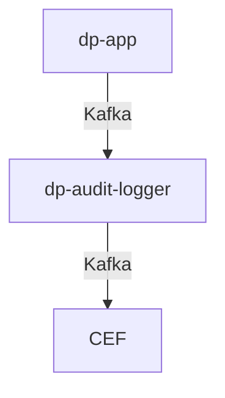

# dp-audit-logger

Har ansvar å ta i mot [aktivitetslogger](https://github.com/navikt/dp-aktivitetslogg/tree/main/aktivitetslogg) fra applikasjoner og
sende auditkontekster fra aktiviteter som ArcSight Common Event Format (CEF) i henhold
til https://sikkerhet.nav.no/docs/sikker-utvikling/auditlogging

Aktivitetslogger publiseres på rapid.v1 topicet publiser aktivitetslogg med [AktivitetsloggEventMapper](https://github.com/navikt/dp-aktivitetslogg/blob/cf41f8530d8196995f6aa0e3cae5247bbd5d2d3d/aktivitetslogg/src/main/kotlin/no/nav/dagpenger/aktivitetslogg/IAktivitetsloggMediator.kt) og blir konsumert av dp-audit-logger.

```kotlin
val aktivitetslogg = Aktivitetslogg()
aktivitetslogg.info(
    melding = "En aktivitet", 
    borgerIdent = "12345678910"
    saksbehandlerNavIdent = "NAV-IDENT",
    operasjon = AuditOperasjon.READ,
)

aktivitetsloggEventMapper.håndter(aktivitetslogg) {
    rapidConnections.publish(
        it.eventNavn,
        it.innhold
    )
}
```


Arkitekturskisser




## Komme i gang

Gradle brukes som byggverktøy og er bundlet inn.

`./gradlew build`

# Henvendelser

Spørsmål knyttet til koden eller prosjektet kan rettes mot:

* André Roaldseth, andre.roaldseth@nav.no
* Eller en annen måte for omverden å kontakte teamet på

## For NAV-ansatte

Interne henvendelser kan sendes via Slack i kanalen #dagpenger.
